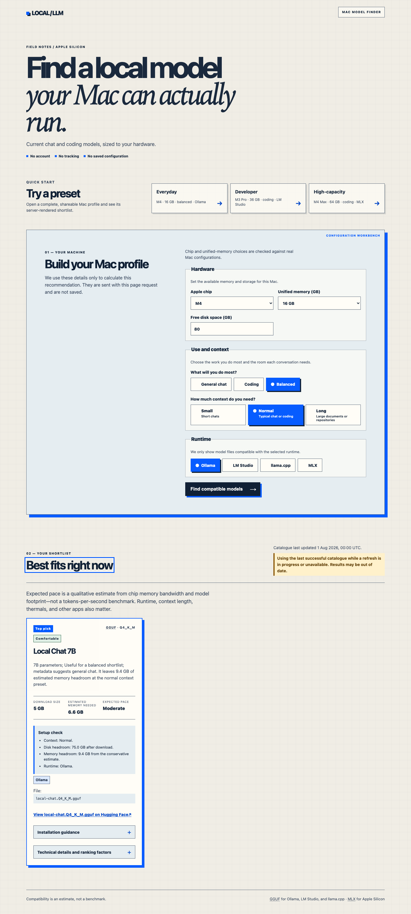

# Mac Local LLM Finder

[Try the live demo](https://local-llm-finder-m7qb.vercel.app/) — a privacy-first finder for current local chat and coding models that fit an Apple Silicon Mac.



Your Mac configuration is used only for that request; it is not saved. The finder gives conservative compatibility, storage, and qualitative pace estimates rather than performance benchmarks.

## Highlights

- Complete, shareable GET links and a server-rendered form that work without JavaScript.
- Validated Apple Silicon chip and unified-memory combinations.
- Runtime-specific GGUF recommendations for Ollama, LM Studio, and llama.cpp, plus MLX recommendations.
- A server-side public Hugging Face catalogue with six-hour caching and stale fallback.

## Request and data flow

```text
GET form or preset link ─┐
                         ├─> validate Mac profile ─> server-side catalogue cache ─> ranked HTML results
POST /api/recommendations ┘                                      └───────────────> JSON results
```

## API

`POST /api/recommendations` accepts the same configuration used by the GET form:

```json
{
  "chip": "m4",
  "memoryGb": 16,
  "diskGb": 80,
  "workload": "balanced",
  "runtime": "ollama",
  "context": "normal"
}
```

A successful response returns the existing recommendation result object, including `recommendations`, `exclusions`, and `stale`. Invalid configurations return `400` with `errors` and `fieldErrors`; a catalogue outage with no cached result returns `503` with `error`.

## Run locally

You need Node.js 24.x.

```bash
npm install
npm run dev
```

Open [http://localhost:3000](http://localhost:3000) after the development server starts.

For project internals, development checks, and architecture details, see [codewiki.md](codewiki.md).
For a repeatable demo handoff, see [the showcase checklist](docs/showcase-checklist.md).
